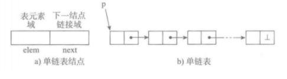
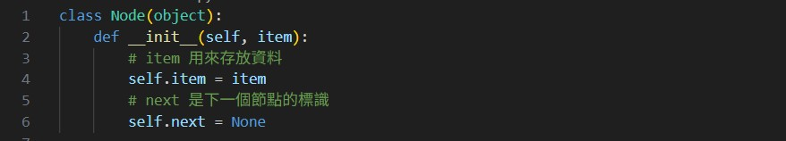

# 南華大學資料結構-第一次期中報告
# 11124208 王品雯
# 題目一: Python数据结构——— 单链表

## 單鍊錶基本結構
```
單向鍊錶也稱為單鍊錶，是鍊錶中最簡單的一種形式，包含兩個域，一個是資訊域一個是連結域，連結域用來指向下一個節點，最後一個節點的連結域指向一個空值。
```


*   表元素欄位elem用來存放具體的資料
*   鏈結欄位next用來存放下一個節點的位置
*   變數p指向鏈結串列的頭節點位置，從p出發可以找到串列中的任意節點

## 節點實現
```


i=len(x)-1
while i >= 0:
  if x[i] % 2 == 1:
    del x[i]
  i-=1
print(x)
```
