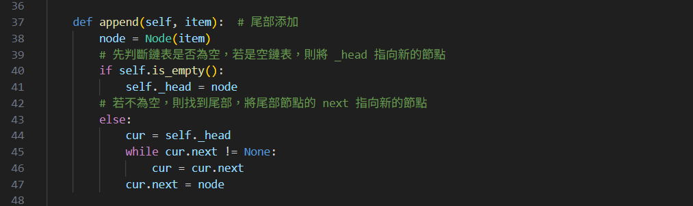

# 南華大學資料結構-第一次期中報告
## 11124208 王品雯
## 題目一：Python 資料結構——單鍊錶

### 單鍊錶基本結構
```
單向鍊錶也稱為單鍊錶，是鍊錶中最簡單的一種形式，包含兩個域，一個是資訊域一個是連結域，連結域用來指向下一個節點，最後一個節點的連結域指向一個空值。
```


*   表元素欄位elem用來存放具體的資料
*   連結域next用來存放下一個節點的位置
*   變數p指向鍊錶的頭節點位置，從p出發可以找到表中的任意節點

### 節點實現


### 單鍊錶操作

*   is\_empty()鍊錶是否為空
*   length()鍊錶長度
*   travel()遍歷整個鍊錶
*   add()鍊錶頭新增元素
*   append()鍊錶尾部新增元素
*   insert()鍊錶任意位置新增元素
*   remove()删除節點
*   search()查找任意節點是否存在

### 單鍊錶的實現


```
頭部添加元素
```


```
尾部添加元素
```


```
任意位置新增元素
```


```
刪除節點
```


